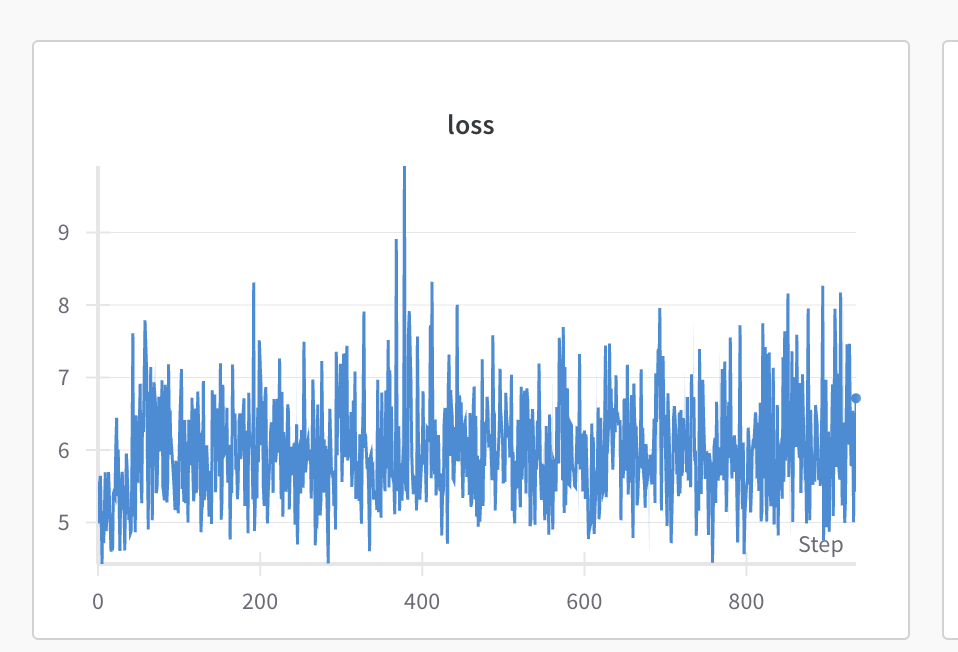
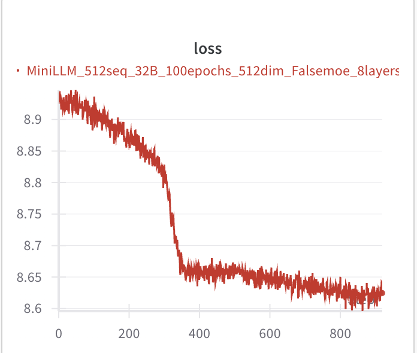

# 预训练实验记录

## 1. 问题现象：logits 出现 NaN 值

### 现象描述
在预训练过程中，模型输出的 logits 出现 NaN 值，具体表现为：
- 输入 X 的统计信息：
  - 最大值: 151645
  - 最小值: 1
  - 平均值: 126917.84375
  - 标准差: 46991.953125
- 所有层的梯度都出现 NaN 值

### 可能的原因
1. 输入数据问题
   - token ID 超出词表范围
   - 数据分布不均匀
   - 输入数据预处理不当

2. 模型训练问题
   - 梯度爆炸
   - 学习率过大
   - 批量大小不合适
   - 模型初始化不当

3. 数值稳定性问题
   - 激活函数选择不当
   - 归一化层问题
   - 混合精度训练配置问题

### 排查步骤
1. 检查输入数据
   ```python
   # 检查 token ID 是否在词表范围内
   if torch.any(X >= model.config.vocab_size):
       Log(f"警告：输入数据包含超出词表范围的索引")
       Log(f"最大索引: {X.max().item()}, 词表大小: {model.config.vocab_size}")
   ```
   发现并无超出词表范围的 token ID

2. 检查模型初始化
   ```python
   # 检查模型参数初始化
   for name, param in model.named_parameters():
       if torch.isnan(param).any():
           Log(f"警告：参数 {name} 在初始化时包含 NaN 值")
   ```
   发现并无 NaN 值

3. 监控训练过程
   ```python
   # 检查每一层的输出
   for name, module in model.named_modules():
       if isinstance(module, torch.nn.Linear):
           if hasattr(module, 'output'):
               output = module.output
               if torch.isnan(output).any():
                   Log(f"层 {name} 的输出包含 NaN 值")
   ```
   训练过程中出现了 NaN值，说明问题是模型训练导致

### 解决方案
1. 数据预处理
   - 确保 token ID 在词表范围内
   - 检查数据分布
   - 添加数据验证步骤

2. 训练参数调整
   ```python
   # 降低学习率
   parser.add_argument("--learning_rate",type=float,default=1e-5)
   
   # 降低梯度裁剪阈值
   parser.add_argument("--grad_clip",type=float,default=0.1)
   
   # 减小批量大小
   parser.add_argument("--batch_size",type=int,default=4)
   ```

3. 添加梯度监控
   ```python
   def check_gradients():
       for name, param in model.named_parameters():
           if param.grad is not None:
               grad_norm = param.grad.norm().item()
               if grad_norm > 1000:
                   Log(f"警告：参数 {name} 的梯度范数过大: {grad_norm}")
   ```

### 预防措施
1. 训练前检查
   - 验证输入数据
   - 检查模型初始化
   - 测试单个 batch 的前向传播

2. 训练中监控
   - 添加梯度检查
   - 监控数值稳定性
   - 记录关键统计信息

3. 参数调优
   - 从小学习率开始
   - 使用较小的批量大小
   - 适当设置梯度裁剪阈值

## 2. 问题现象：经过接近约4.7w steps 后，loss 无明显下降

### 现象描述
- 训练曲线图



### 可能的原因
1. 学习率过低

### 尝试方案
1. 增大学习率 
   - 增大学习率到5e-5，继续训练约1.7w steps，loss依然无明显下降，且在1.8w step 后出现大量的 NaN 值
  
2. 降低学习率，增大梯度裁剪阈值
   - 考虑到学习率为5e-5时，出现大量的 NaN 值，所以降低学习率到2e-5，增大梯度裁剪阈值到0.5。
   - 继续训练了2758 steps，loss依然无明显下降，且在2760 step 后出现大量的 NaN 值

3. 增大梯度裁剪阈值
   - 增大梯度裁剪阈值到1.0
   - 再次出现了大量的 NaN 值

4. 降低batch size ✅
   - 降低batch size到1，梯度裁剪阈值为1.0，学习率为2e-5
   - 训练了约1.5w steps，loss看起来有一点点下降，且未出现 NaN 值
  (思考：是否和数量数据有关？使用minimind的数据集测试下？)

5. 增大梯度累计步数
   - 随着batch size 降低，导致GPU的利用率降低，且观察发现适当的增加梯度累计步数可以有效提高计算速度，从22iter/s 提高到34iter/s；因此将梯度累计步数增大到100，但是gpu的利用率并未提高。

6. 更换为minimind的数据集
   - 由于loss一直为下降，因此更换了minimind的数据集，出现了一定程度的loss上升
  
## 反思
1、是否和tokenizer有关？
   - qewn2的tokenizer 中的vocab_size 更大，导致模型更加难以训练（训练周期变长）
   - 验证方式：
      - qwen2的tokenizer 的vocab_size 更大，为151643个，但是minimind的tokenizer只有6400个，相差23倍，因此考虑是否和tokenizer有关。
      - TODO：使用minimind的tokenizer和qwen2的tokenizer分别训练，并使用相同的batch size和梯度累计步数
  
2、是否和数据集有关？
      bos_token: None
      eos_token: <|im_end|>
      pad_token: <|endoftext|>
      unk_token: None
   预训练数据集是否需要提前拼接上bos_token和eos_token？
   答：不需要，self.tokenizer(
            text,
            max_length=self.max_len,
            padding="max_length",
            truncation=True,
            return_tensors="pt",
            add_special_tokens=True,
        )
        中，add_special_tokens=True，会自动在文本开头添加bos_token，在文本结尾添加eos_token

3、模型计算效率低 ✅
   - 是否和数据长度有关，比如部分数据的长度远小于max_len，导致padding的浪费？
   - 答：是的，会导致浪费，因此需要在数据预处理时，将所有数据的长度都拼接到max_len的长度。
   - 提问：这种拼接会导致 一条数据的开头并没有表达完整，而是被截断的一句话，比如完整的一句话为：今天天气不错。但由于拼接的存在导致“今天天” 被拼接到上一条数据中，“气不错。”存在当前数据中。也就是说这句话被分割到两个不同的数据中了。
     - 答： GPT 类自回归模型预训练目标是：预测下一个 token，而不是理解完整句子，所以它实际上并不在意你是不是打断了自然语言中的完整语义单位（如句子或段落）。
       那这样“打断语义”合理吗？
       在 预训练阶段：完全合理且广泛采用
         •	预训练本质上是让模型学到 token-level 的语言分布、上下文结构和语言模式。
         •	大多数 GPT 模型的预训练都是用这种方式构造的：
         •	将整个语料拼接成一个超长序列（比如上百 GB 的 token）
         •	然后每次从中取一段（block size），训练预测下一个 token。
         •	模型通过大量这样的“连续 token block”训练，可以自然学会句子的边界结构，不需要每次都从一个完整的句子开始。

## 实验记录2

- 本次使用自己训练的tokenizer，词表大小为6400，batch size为32，梯度累计步数为100，学习率为3e-5，max_len为512，n_layers为8，n_heads为8，dim为512，use_moe为False，data_path为minimind的数据集。
- 将所有数据拼接成统一的max_len的长度
  
  - 初步结论：较小的vocab可以有效提高模型 “学会说话” 的速度。
  - 统一到max_len长度可以提高gpu的利用率。

### 现象描述
- 训练了大约两个epoch 观测到loss在明显下降，但是下降速度太慢，
- 训练曲线图



### 可能的原因
1. 学习率过低，尝试增大学习率到1e-3，
   1. 结果：loss下降速度变快，但是训练了约1个epoch后，loss出现了震荡现象，且loss下降到一定程度后，loss不再下降。
2. 将学习率 降低到5e-4，
   1. 现象：出现了loss上升的情况，不明所以。。。。
3. 再次将学习率降低到1e-4，
   1. 现象：未观测到明显的loss下降。
4. 将梯度累计降低为1，batch size 保持32不变
   1. 现象：由于降低了梯度累计，单次的loss出现了明显的下降，但这并不能说明loss下降了，因为梯度累计为1，相当于没有梯度累计，还需要多观察整体loss的变化。
   2. 现象2：整体loss的波动出现了大幅的跳跃，
5. 将batch size 降低为1，其他参数不变
   1. 现象1：继续训练时出现了：梯度范数过大的提示
   2. 现象2：loss在震荡
   3. 现象3：测试验证发现模型生成的数据长度偏短，
6. 将学习率降低到1e-5，其他参数不变
   1. 现象1：loss在震荡，不下降
7. 更换更小的数据集，数据集中单条数据更长，看下是否会改善偏短问题，以及是否会对loss下降有帮助
   1. 现象：报错了，反推debug尝试将tokenizer处理后的数据反推回去，发现decode的数据出现了很多乱码和错误的特殊标记符。
   2. 思考：在tokenizer处理的时候发现可以正确的编码，但是读取数据的时候却发现问题，难道是保存的时候出现了问题？把之前缓存的parquet文件删除，重新读取数据，发现问题不在出现，很神奇。。。
   3. 切换回minimind 的数据集，看下是不是也存在tokeizer处理后回不去的情况。
8. 继续训练minimind 的数据集，loss下降速度很慢，调整梯度裁剪阈值为20，默认不对所有梯度进行裁剪，只对梯度范数大于100的梯度进行裁剪，增加batch size 为10，增加梯度较小的检测
   1. 现象：提示attention和ffn层出现了梯度范数过小的问题
9. 增大学习率到5e-4，其他参数不变，继续观察loss情况
   1. 现象1：依然出现大量的梯度范数过小的问题，说明梯度消失了，loss下降速度变慢。
10. 增大梯度累计步数为50，其他参数不变
    1. 现象：由于梯度累计步数增大，导致单次loss出现了上涨，如图 [!增加梯度累计导致loss上升.png]，继续训练观察loss是否会出现下降。
    

## 实验记录3
- 本次使用minimind的tokenizer。值得注意的是，他训练的vocab确实为6400，但是我训练的tokenizer的vocab为6402，多个bos_token和eos_token。需要检查一下。

### 现象描述
- loss再次爆炸，头大。。

### 尝试方案
1. 使用minimind的模型+minimind的tokenizer + minimind的数据集 + minimind的训练代码进行训练，发现一切正常，
2. 将其切换为我自己写的模型代码，发现一切正常。可能是训练代码或者参数的问题？训练代码未发现明显异常。
3. 最终发现是训练代码的问题：
   1. scaler = torch.amp.GradScaler(enabled=(args.dtype in ["bfloat16","float16"])) # 梯度缩放，用于防止梯度爆炸，由于将dtype设置为torch.bfloat16，而不是字符串，导致梯度缩放失效，从而导致梯度爆炸。
   2. 提问：为什么要使用GradScaler？否则一定会出现梯度消失或者梯度爆炸？
   3. 答：基本功能：
      梯度缩放器主要用于解决使用float16/bfloat16训练时的数值下溢问题
      它会自动缩放梯度，防止梯度值太小而丢失精度
      在反向传播时放大梯度，在优化器更新参数时再缩小回来
      为什么需要它：
      当使用float16/bfloat16时，数值范围比float32小很多
      小梯度值可能会被截断为0，导致训练不稳定
      梯度缩放器通过动态调整缩放因子来解决这个问题
      对大模型预训练的影响：
      内存使用：使用AMP可以显著减少显存占用，通常可以节省30-50%的显存
      训练速度：可以提升训练速度，通常能提升1.5-2倍
      训练稳定性：通过梯度缩放，可以保持训练的稳定性
      模型性能：在大多数情况下，不会影响最终模型的性能
      实际应用中的注意事项：
      需要配合torch.cuda.amp.autocast()上下文管理器使用
      在反向传播时使用scaler.scale(loss).backward()
      在优化器更新时使用scaler.step(optimizer)和scaler.update()
      如果没有这行代码，在使用float16/bfloat16训练大模型时可能会遇到：
         训练不稳定
         梯度消失
         模型无法收敛
         显存节省效果不明显
      因此，这行代码对于大模型预训练来说是非常重要的，特别是在资源受限的情况下，它可以帮助我们更高效地训练模型。


## 实验记录4

- 测试更大的tokenizer vocab（qwen2）对收敛速度的影响
    1. 现象：loss更大，收敛速度更慢，测试验证效果更差。总体符合猜测预期。
- 